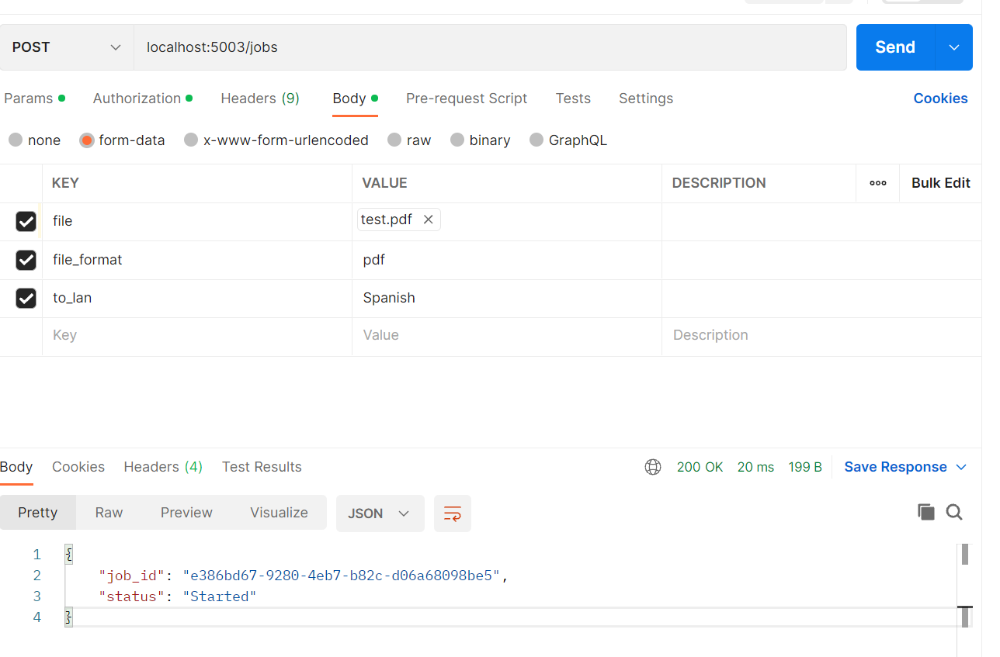
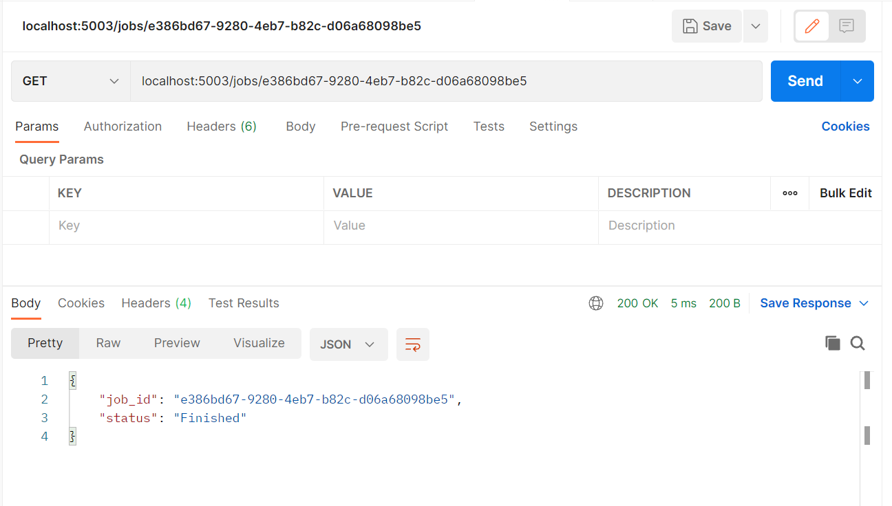
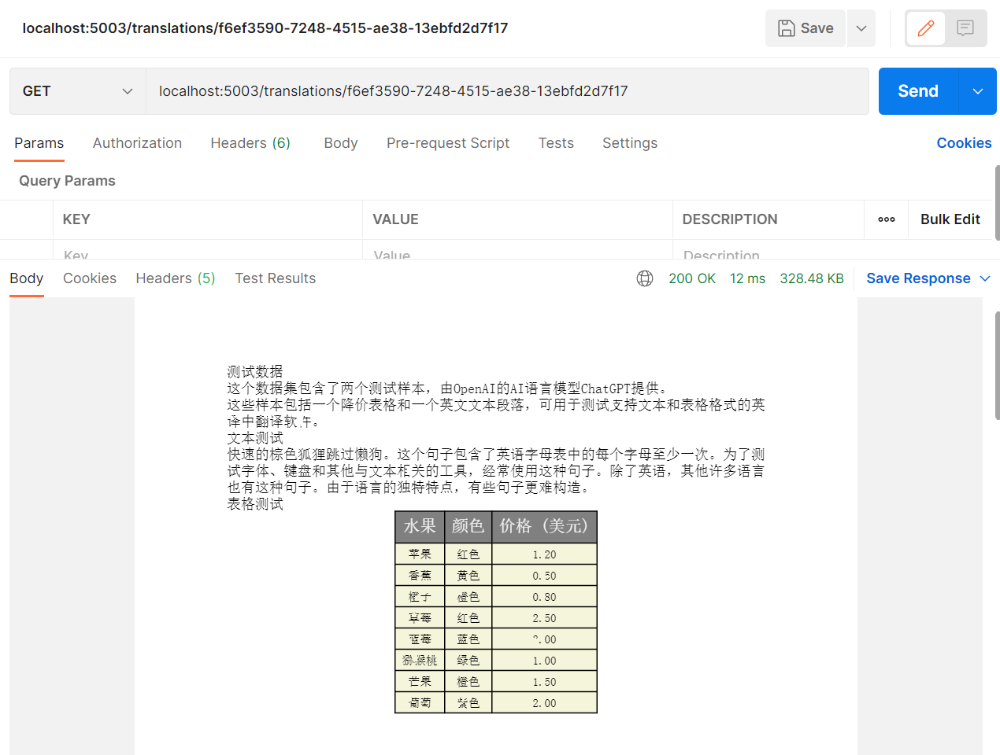
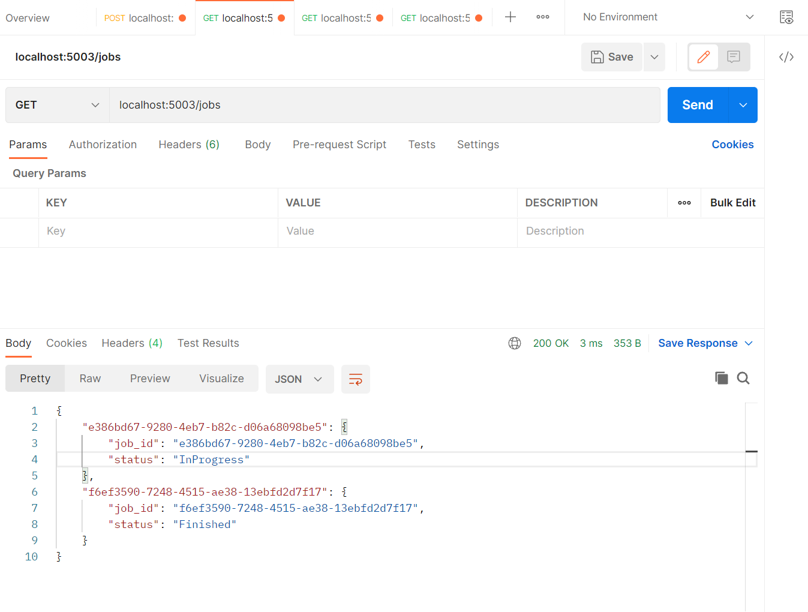
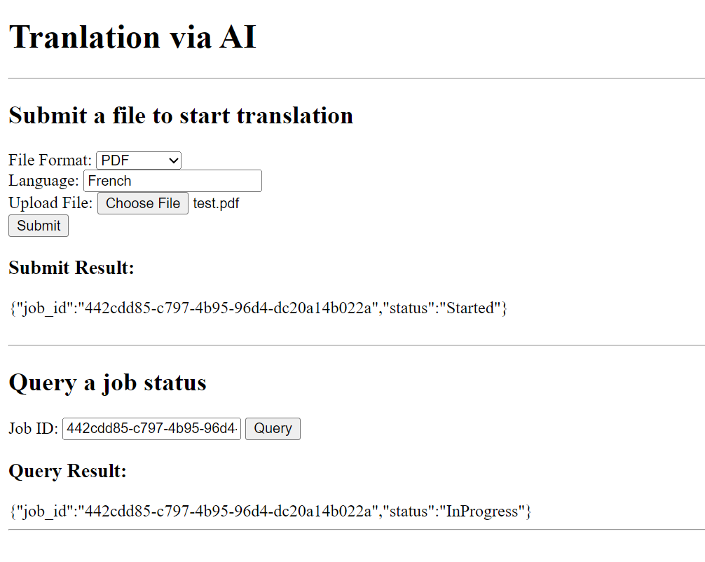
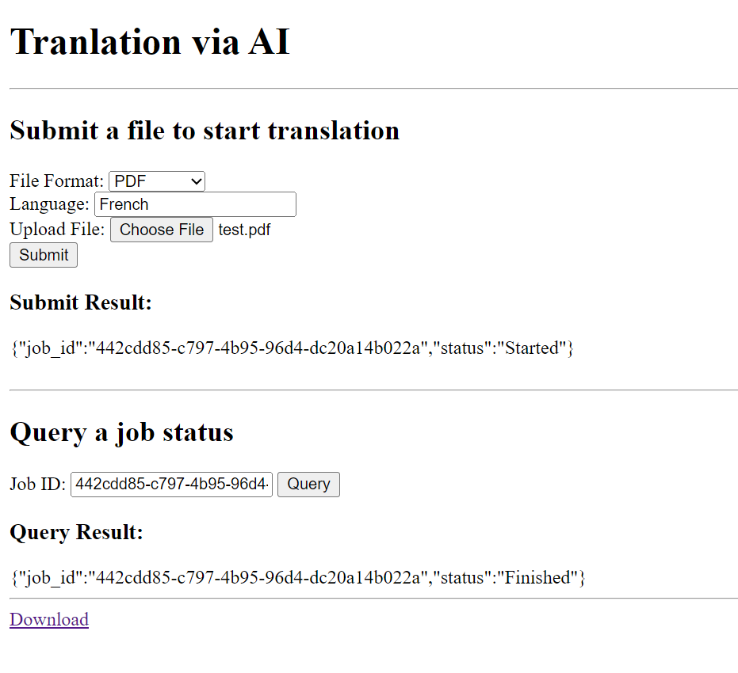
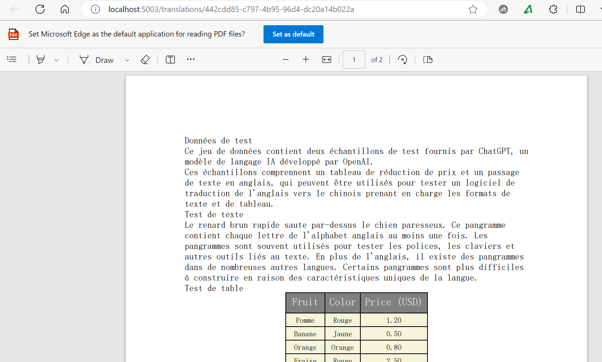

# AI Translator 
最近在极客时间学习《AI 大模型应用开发实战营》，自己一边跟着学一边开发了一个进阶版本的 OpenAI-Translator。在这里简单记录下所支持的特性、设计要点和心得体会，供有兴趣的同学参考。


# 特性和架构
该项目在原项目的架构基础上，实现以下特性：
1. Rest服务化
2. 多语言支持
3. 对PDF原始布局的支持，包括：按顺序打印、图片输出、合并文本
4. 支持图形化界面

为了支持上述特性，增加或修改了以下部分：
1. server.py基于QUART提供restful接口
2. templates目录提供index.html实现网页的渲染
3. Content类增加了bbox属性，用于表示pdf内容的位置信息
4. writer.py增加对图像的pdf输出
5. 增加了参数和配置项
6. pdf_parser.py基本重写
7. main函数根据参数，以rest服务的启动服务或以原有方式直接进行翻译

# Rest服务化
Rest服务采用Quart框架，由于进行翻译的是一件耗时的操作，因此，需要采用异步方式提供服务，一般流程如下：
1. 用户提交翻译任务
   
   URL:<code>POST /jobs</code>  
   参数：通过form-data方式提交任务
   参数名称|描述|必须
   -|-|-
   file|待翻译的pdf文件|是
   file_format|翻译后的格式，pdf或者md|否，默认为pdf
   to_lan|以什么语言翻译，Chinese, Spanish, etc.|否，默认为Chinese

   返回：以下列json格式返回
```
{
    "job_id": "e386bd67-9280-4eb7-b82c-d06a68098be5",
    "status": "Started"
}    
```
   字段|描述
   -|-
   job_id|提交的任务id，后续可以用该id查询其状态和翻译结果
   status|状态：Started, InProgress, Finished
   
   样例:
   

2. 用户根据上述提交的任务后返回的id查询任务进度

URL:<code>GET /jobs/{job_id}</code>  
参数：<code>job_id</code>为路径参数，即提交job任务（接口1）返回的job_id

返回：以下列json格式返回（与接口1格式一样）
```
{
    "job_id": "e386bd67-9280-4eb7-b82c-d06a68098be5",
    "status": "Started"
}    
```



3. 当任务完成后，用户根据上述提交的任务后返回的id下载翻译后的文件 

URL:<code>GET /translations/{job_id}</code>  
参数：<code>job_id</code>为路径参数，即提交job任务（接口1）返回的job_id  
返回：返回文件字节流
   


4. 查询所有任务状态
   
   URL:<code>GET /jobs</code>  
参数：无  
返回：以下列json格式返回
```
{
    "e386bd67-9280-4eb7-b82c-d06a68098be5": {
        "job_id": "e386bd67-9280-4eb7-b82c-d06a68098be5",
        "status": "InProgress"
    },
    "f6ef3590-7248-4515-ae38-13ebfd2d7f17": {
        "job_id": "f6ef3590-7248-4515-ae38-13ebfd2d7f17",
        "status": "Finished"
    }
}  
```
  


## 设计要点
1. 因为翻译的函数调用为非异步方式，因此本实现中采用简单的线程方式进行异步翻译，用户提交任务接口马上返回任务id，当翻译完成后，结果写入内存；通过其他接口根据任务id查询任务状态和翻译结果。
2. 对原有的PDFTranslator、PDFParser和Writer进行改造以便能够接受字节流的pdf文件输入，以及字节流的文件输出
3. 配置文件的下列配置项成为rest接口的参数：pdf文件、待翻译的目标语言、翻译的格式

## 待改进地方
以下是有待改进的地方：
1. 数据没有持久化，用户所提交的任务以及任务结果均在内存，即当应用重启，数据失效
2. 健壮性：每一个任务启动一个线程进行翻译，没有对翻译线程做管理
3. 任务相关的metadata稍缺，例如执行时间等；当然，目前来看，简单应用是够了

# 多语言支持及Prompt设计
针对openai进行设计，引入了System角色：
1. 普通文本的prompt：

```
messages = [
                {"role": "system", "content": "You are an expert in translation from {} to {}".format(from_lan, to_lan)},
                {"role": "user", "content": prompt}
            ]
```

例如

```
[
    {
        'role': 'system', 
        'content': 'You are an expert in translation from English to Spanish'
    }, 
    {
        'role': 'user', 
        'content': 'Please translate：These samples include a markdown table and an English text passage, which can be used to test an English-to-Chinese translation software supporting both text and table formats.'
    }
]
```

2. 针对Table的prompt

```
messages = [
                {"role": "system", "content": "You are an expert in translation from {} to {}. Output in table format and keep the delimeter and spacing.".format(from_lan, to_lan)},
                {"role": "user", "content": prompt}
            ] 
```

例如：
```
[
    {
        'role': 'system', 
        'content': 'You are an expert in translation from English to Spanish. Output in table format and keep the delimeter and spacing.'
    }, 
    {
        'role': 'user', 
        'content': 'Fruit,Color,Price (USD)\r\nApple,Red,1.20\r\nBanana,Yellow,0.50\r\nOrange,Orange,0.80\r\nStrawberry,Red,2.50\r\nBlueberry,Blue,3.00\r\nKiwi,Green,1.00\r\nMango,Orange,1.50\r\nGrape,Purple,2.00\r\n'
    }
]
```

## 设计要点
1. 针对文本，需要加上"Please translate:"作为前缀，如果不加，在一些情况下会产生乱七八糟的内容，即使加上了system的角色
2. 针对table，要使用<code>pandas.DataFrame.to_csv()</code>函数，因为如果使用原有的<code>tolist</code>函数，则字段之间的分隔符输出为空格，那么针对<code>Price (USD)</code>字段，翻译后为<code>价格 (美元)</code>，在“价格”和“（美元）”之间有一个空格，这种格式的字符串会将header划分为四个字段：水果，颜色，价格，（美元）。
3. 为了支持多语言，那么在各相关类中引入<code>to_lan</code>参数，针对[test.pdf](examples/test.pdf)，请参考 [中文](examples/test_Chinese.pdf) 和 [西班牙文](examples/test_Spanish.pdf) 的翻译结果

# 对PDF原始布局的支持
原有的实现有如下几个问题：
1. 对于横跨两行或者多行的句子，被分割为多个句子进行翻译，效果可能会不好
2. 仅通过字符串匹配来删除文本部分的table内容，有可能有误删情况
3. 文本和table输出顺序无法保证
4. pdf输出没有图片

## 实现和设计要点
1. 通过find_tables查询获得所有表格，注意不使用extract_tables，因为后者仅保留table的内容而无其他布局内容信息，加入到page的content数组
2. 通过page.images获取所有图片，加入到page的content数组
3. 通过extract_words获取所有文字（包含文字的布局信息）
4. 对上一步找出的文字的布局信息（bbox=（左上角x坐标，左上角y坐标，右下角x坐标，右下角y坐标）），通过计算IOU判断是否与page的content数组（目前只有table和image）的任意项有重叠，如有，则过滤之（目前判断是否重叠的逻辑为IOU>0）
5. 对上一步的结果进行文字合并
6. 将合并后的文字加入到page的content数组
7. 根据bbox对page的content数组进行排序

另外，图片的输出较为简单，无需进行翻译，直接将page按照images的bbox进行crop然后通过to_image变为PIL.Image格式写入translation字段，在写入输出pdf时，使用BytesIO将图片变为字节流然后通过reportlab的Image类写入。

## 待改进
1. 暂时无字体大小、行距等进一步的布局信息
2. 排序默认按照bbox进行排序，但实际使用中，如果是从上到下、然后再从左到右的话，那么最好的排序按照（左上角y坐标，左上角x坐标）来排序更合适

# 图形化界面支持
图形化界面方面，本项目使用了两种支持：gradio和html

## gradio
请参考[gradio_gui.ipynb](gradio_gui.ipynb)文件，其中要注意下面两点：
1. 文件上传的时候，使用默认的<code>type=file</code>的File插件，会造成读取出来的文件为空文件（可能是gradio的bug，暂时未发现root cause），因此需要采用<code>type=binary</code>
2. 针对文件下载，gradio没有这方面的支持，因此只是生成一个下载url


## html
通过chatgpt生成html，然后用quart的render_template渲染即可。注意，quart需要允许CORS，否则会出现请求返回200，但response内容不能返回的错误，以下是如何允许CORS的设置（也是通过询问chatgpt得到的结果），当然，这不是太安全，但对于demo足够。
```
app = Quart("Trasnlation")
app = cors(app, allow_origin="*")
```
下面是几个样例：
1. 提交任务



2. 查询任务


3. 下载


# 配置文件改动
为了配合上述的特性，配置文件增加了以下配置项：
```
OpenAIModel:
    proxy: <your proxy>
common:
    to_lan: "Chinese"
    rest_port: 5003
```